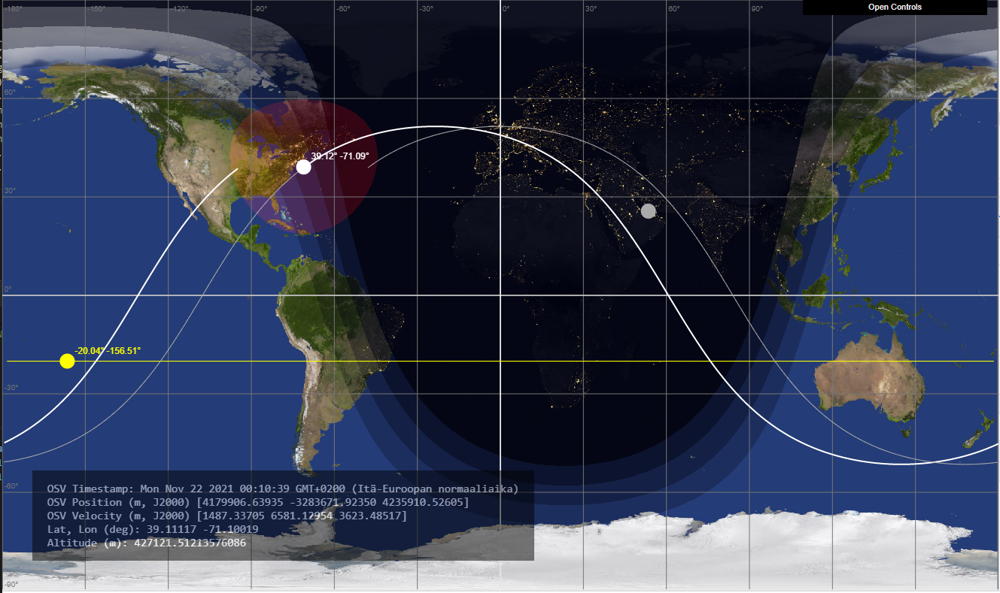

# ISSLive_Sun

Visualization of the ISS ground track.

Simple visualization of the ISS ground track computed from the Lightstreamer ISSLive feed. Each ground track is obtained from the latest Orbit State Vectors (OSV) by computation of the [osculating Keplerian elements](https://github.com/vsr83/Osculating/blob/main/derivation.pdf).

The visualization is extension of my earlier project [sunangle_shader](https://github.com/vsr83/sunangle_shader). 

Click below to execute in browser.

